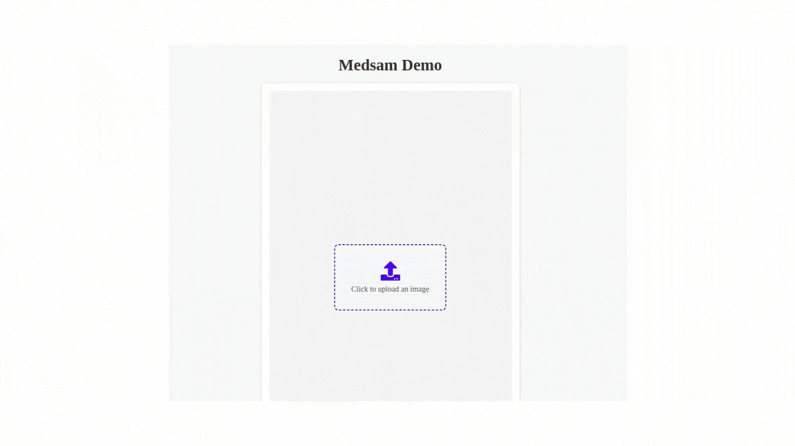

# medSAM Application

This application provides a backend and frontend for running the MedSAM machine learning model to perform segmentation tasks. Below are the steps to set up and run the application.

## Prerequisites

Before setting up the backend and frontend, ensure you have the following installed:

1. **Anaconda**: If not installed, download and install Anaconda from [here](https://www.anaconda.com/products/individual).
   
2. **Node.js (v22)**: Install Node.js v22 from [here](https://nodejs.org/en/).

3. **CUDA (optional)**: If you're planning to use a GPU, ensure that CUDA drivers are installed according to the instructions provided by NVIDIA. This is necessary for PyTorch GPU support.


## Clone the Repository
```bash
git clone https://github.com/Patel-Aman/medSAM
cd medSAM
```

---

## Backend Setup

Navigate to the backend directory:
```bash
cd medSAM
cd backend
```

### Installation
1. **Create a virtual environment:**
   ```bash
   conda create -n medsam python=3.10 -y
   conda activate medsam
   ```

2. **Install PyTorch 2.0:**
   Follow the instructions from the [PyTorch website](https://pytorch.org/get-started/locally/) to install the appropriate version for your system.

3. **Install dependencies:**
   ```bash
   pip install -e .
   ```
4. **Download Model**
   Download the [medSAM checkpoint](https://drive.google.com/drive/folders/1ETWmi4AiniJeWOt6HAsYgTjYv_fkgzoN?usp=drive_link) and place it at `work_dir/MedSAM/medsam_vit_b.pth`
   Download the [SAM checkpoint](https://dl.fbaipublicfiles.com/segment_anything/sam_vit_b_01ec64.pth) and place it at `work_dir/MedSAM/sam_vit_b_01ec64.pth`

4. **Start the backend server:**
   ```bash
   python3 api.py
   ```

---

## Frontend Setup
Create a new terminal window.  
Navigate to the frontend directory:
```bash
cd medSAM
cd frontend
```

### Installation
1. **Install frontend dependencies:**
   ```bash
   npm install
   ```

2. **Run the development server:**
   ```bash
   npm run dev
   ```

---


## Application Usage
- Use the provided endpoints to upload images and perform segmentation tasks via the frontend interface.
- Ensure the backend server is running before starting the frontend.

---

## Demo


---

## Additional Notes
- Ensure you have the required CUDA drivers installed if using GPU for processing.
- Adjust the `api.py` or frontend configuration if running on non-default ports or IPs.

